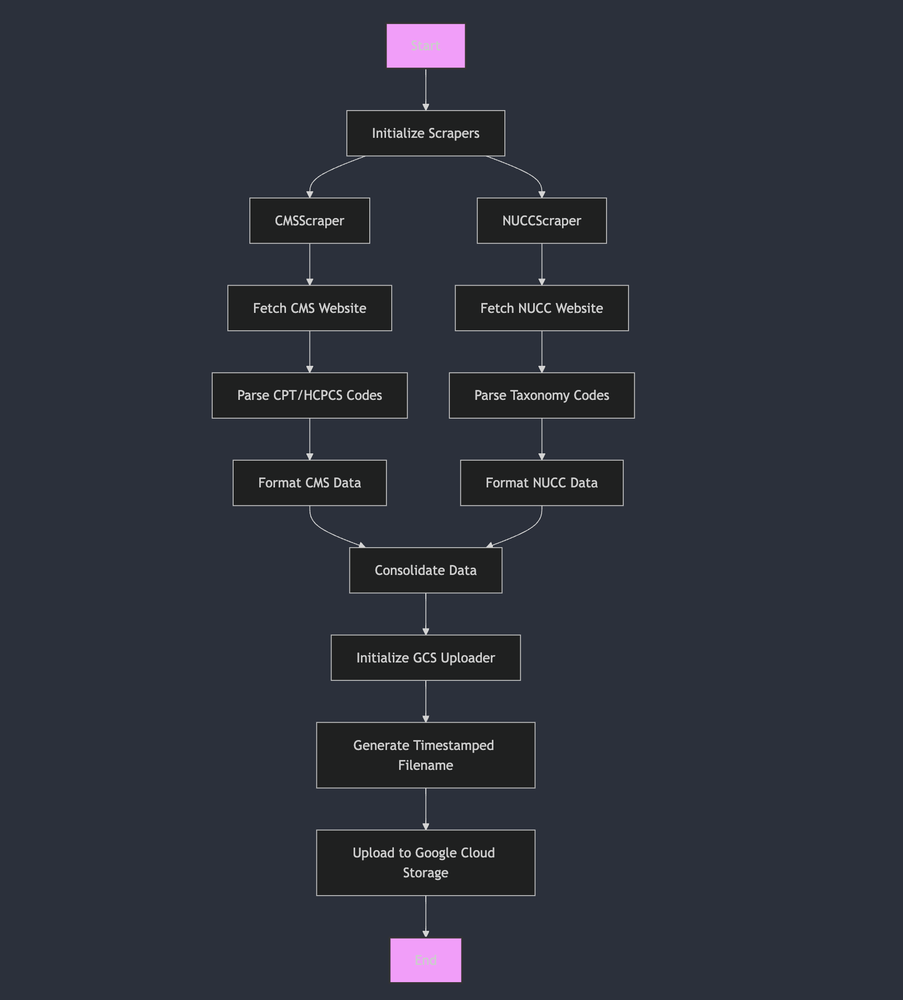

# Taxonomy and CPT Code Scraper

A Python script that scrapes CMS CPT/HCPCS codes and NUCC taxonomy codes, consolidates them into a JSON format, and uploads the results to Google Cloud Storage.

## URLs to Scrape

- [CMS CPT/HCPCS Codes](https://www.cms.gov/medicare/coverage/cpt-codes)
- [NUCC Taxonomy Codes](https://taxonomy.nucc.org/)

## Features

- Scrapes CMS CPT/HCPCS codes from cms.gov
- Scrapes taxonomy codes from NUCC
- Combines data into a structured JSON format
- Uploads results to Google Cloud Storage
- Includes error handling and logging
- Designed to run in a Cloud Function environment

## Prerequisites

- Python 3.7+
- Google Cloud Storage account and credentials
- Access to the internet

## Installation

1. Clone this repository
2. Install dependencies:
   ```bash
   pip install -r requirements.txt
   ```

## Configuration

1. Create a `.env` file in the project root with the following variables:
   ```
   GCS_BUCKET_NAME=your-bucket-name
   ```

2. Set up Google Cloud credentials:
   - Option 1: Set GOOGLE_APPLICATION_CREDENTIALS environment variable
     ```bash
     export GOOGLE_APPLICATION_CREDENTIALS="/path/to/service-account-key.json"
     ```
   - Option 2: Use Google Cloud SDK authentication
     ```bash
     gcloud auth application-default login
     ```

## Usage

Run the script:
```bash
python scraper.py
```

The script will:
1. Scrape both CMS and NUCC websites
2. Create JSON files with the scraped data
3. Upload the files to GCS with timestamps in the filenames

## Workflow


## Output Format

The script generates JSON files with the following structure:
```json
{
  "source": "cms" or "nucc",
  "code": "string",
  "description": "string",
  "category": "string",
  "taxonomy_code": "string",
  "cpt_code": "string"
}
```

## Error Handling

- The script includes comprehensive error handling and logging
- Logs are written to `scraper.log`
- Failed requests are retried automatically
- All errors are logged with detailed information

## Deployment to Google Cloud Functions

### Prerequisites

1. Install Google Cloud SDK
2. Enable required APIs:
   ```bash
   gcloud services enable \
     cloudfunctions.googleapis.com \
     cloudbuild.googleapis.com \
     cloudscheduler.googleapis.com
   ```
3. Create a service account with the following roles:
   - Cloud Functions Invoker
   - Storage Object Creator
   - Cloud Scheduler Job Runner

### Initial Deployment

1. Set up environment variables:
   ```bash
   export PROJECT_ID=your-project-id
   export SERVICE_ACCOUNT=your-service-account@your-project.iam.gserviceaccount.com
   ```

2. Deploy using Cloud Build:
   ```bash
   gcloud builds submit --config=cloudbuild.yaml \
     --substitutions=_SERVICE_ACCOUNT=$SERVICE_ACCOUNT
   ```

3. After the first deployment, get your function URL:
   ```bash
   export FUNCTION_URL=$(gcloud functions describe taxonomy-scraper --format='value(httpsTrigger.url)')
   ```

4. Update the Cloud Scheduler job with the function URL:
   ```bash
   gcloud builds submit --config=cloudbuild.yaml \
     --substitutions=_SERVICE_ACCOUNT=$SERVICE_ACCOUNT,_FUNCTION_URL=$FUNCTION_URL
   ```

### Schedule Configuration

The function is configured to run daily at midnight UTC through Cloud Scheduler. To modify the schedule:

1. Update the schedule in `cloudbuild.yaml` using cron syntax
2. Redeploy using the commands above

### Monitoring

Monitor function execution through:
- Cloud Functions logs
- Cloud Scheduler job history
- Storage bucket for uploaded files

## Deployment with GitHub Actions

As an alternative to Cloud Build, you can deploy using GitHub Actions.

### Prerequisites

1. Fork/clone this repository to your GitHub account
2. Set up the following GitHub Secrets:
   - `SCRAPER_GCP_PROJECT_ID`: Your Google Cloud project ID
   - `SCRAPER_GCP_SA_KEY`: Your service account key JSON (base64 encoded)
   - `SCRAPER_GCP_SERVICE_ACCOUNT`: Your service account email
   - `SCRAPER_GCS_BUCKET_NAME`: Your GCS bucket name

### Deployment Process

The GitHub Actions workflow will:
1. Trigger on:
   - Push to main branch
   - Pull requests to main branch
   - Daily at midnight UTC
   - Manual trigger via workflow_dispatch

2. Execute the following steps:
   - Run tests
   - Deploy to Cloud Functions
   - Set up/update Cloud Scheduler
   - Notify deployment status

### Manual Deployment

To manually trigger a deployment:
1. Go to the "Actions" tab in your GitHub repository
2. Select the "Deploy Taxonomy Scraper" workflow
3. Click "Run workflow"
